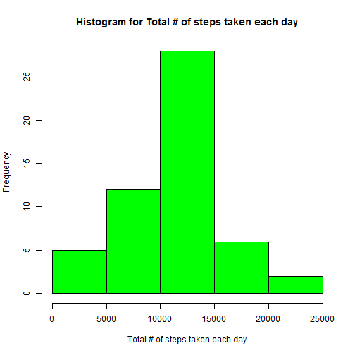
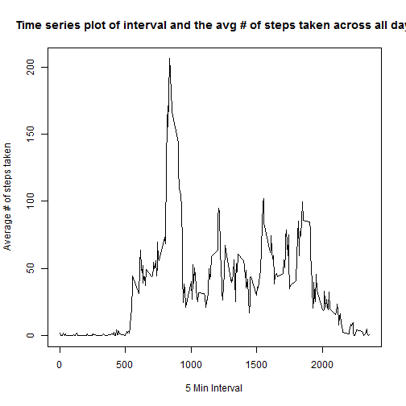
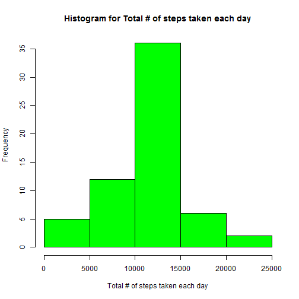
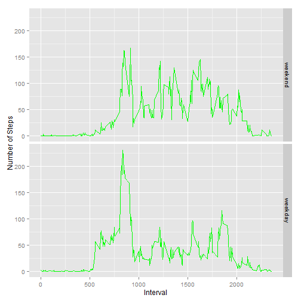

Reproducible Research - Peer Assignment 1
=========================================

  
This is my Rmarkdown file for the Reproducible Research - Peer Assignment 1  
  

##1. Loading and Preprocessing data


```r
 ActvityData <- read.csv("C:/users/kishan/documents/DS/DS5/activity.csv")
 ActvityData[,2] <- as.Date(ActvityData[,2],format = "%Y-%m-%d")
```

##2. What is mean total number of steps taken per day?


```r
 StepsByDayData <- aggregate(steps~date,ActvityData,sum)
 hist(StepsByDayData$steps,col = "green",main = "Histogram for Total # of steps taken each day", xlab = "Total # of steps taken each day")
```

 

```r
 meanSBD <- mean(StepsByDayData$steps)
 medianSBD <- median(StepsByDayData$steps)
```

- Mean of total number of steps taken per day in the original dataset is **1.0766189 &times; 10<sup>4</sup>** and the Median of total number of steps taken per day in the original dataset is **10765**

##3. What is the average daily activity pattern?


```r
 StepsByIntervalData <- aggregate(steps~interval,ActvityData,mean)
 plot(StepsByIntervalData$interval,StepsByIntervalData$steps,type = "l", xlab = "5 Min Interval", ylab = "Average # of steps taken", main = " Time series plot of interval and the avg # of steps taken across all days")
```

 

```r
 maxStepsInterval <- subset(StepsByIntervalData,StepsByIntervalData$steps == max(StepsByIntervalData$steps))[1,1]
```

- The 5-minute interval, on average across all the days in the dataset that contains the maximum number of steps is **835** 

##4. Imputing missing values


```r
 nacount <- sum(is.na(ActvityData$steps))
 
 ActvitynaData <- subset(ActvityData, is.na(ActvityData$steps))
 for (i in 1:nrow(ActvitynaData))
 {
    tempvalue <- ActvitynaData[i,3]
    ActvitynaData[i,1] <- subset(StepsByIntervalData,StepsByIntervalData[,1]==tempvalue)[1,2]
 }
 
 ActvitynnaData <- subset(ActvityData, !is.na(ActvityData$steps))
 newActvityData <- rbind(ActvitynaData,ActvitynnaData)
 
 newStepsByDayData <- aggregate(steps~date,newActvityData,sum)
 hist(newStepsByDayData$steps,col = "green",main = "Histogram for Total # of steps taken each day", xlab = "Total # of steps taken each day")
```

 

```r
 newmeanSBD <- mean(newStepsByDayData$steps)
 newmedianSBD <- median(newStepsByDayData$steps)
```

- Total # of missing values in the original dataset is **2304**  
- Mean of total number of steps taken per day in the new dataset is **1.0766189 &times; 10<sup>4</sup>** and the Median of total number of steps taken per day in the new dataset is **1.0766189 &times; 10<sup>4</sup>**  
- There are **no changes** in the mean of total number of steps taken per day between the original and the new datasets  
- The Median of total number of steps taken per day in the new dataset is **higher** than the median in the original dataset  

##5. Are there differences in activity patterns between weekdays and weekends?


```r
 weekdayslist <- c('Monday', 'Tuesday', 'Wednesday', 'Thursday', 'Friday')
 newActvityData$wdayind <- factor((weekdays(newActvityData$date) %in% weekdayslist), levels=c(FALSE, TRUE), labels=c('weekend', 'weekday'))
 
 newStepsByIntervalData <- aggregate(steps~interval+wdayind,newActvityData,mean)
 library(ggplot2)
```

```
## Warning: package 'ggplot2' was built under R version 3.2.2
```

```
## Find out what's changed in ggplot2 with
## news(Version == "1.0.1", package = "ggplot2")
```

```r
 g <- ggplot(newStepsByIntervalData,aes(interval,steps))
 g+ geom_line(color = "green") + facet_grid(wdayind~.) + labs(x = "Interval",y = "Number of Steps")
```

 

```r
 wdmeanSBI <- mean(subset(newStepsByIntervalData,wdayind = 'weekday')$steps)
 wemeanSBI <- mean(subset(newStepsByIntervalData,wdayind = 'weekend')$steps)
 wdmedianSBI <- median(subset(newStepsByIntervalData,wdayind = 'weekday')$steps)
 wemedianSBI <- median(subset(newStepsByIntervalData,wdayind = 'weekend')$steps)
```

- Mean of total number of steps taken per day during weekends is **38.9884913**
- Mean of total number of steps taken per day during weekdays is **38.9884913** 
- Median of total number of steps taken per day during weekends is **28.1332547** 
- Median of total number of steps taken per day during weekdays is **28.1332547**   
- There is **no difference** in activity patterns between weekdays and weekends


